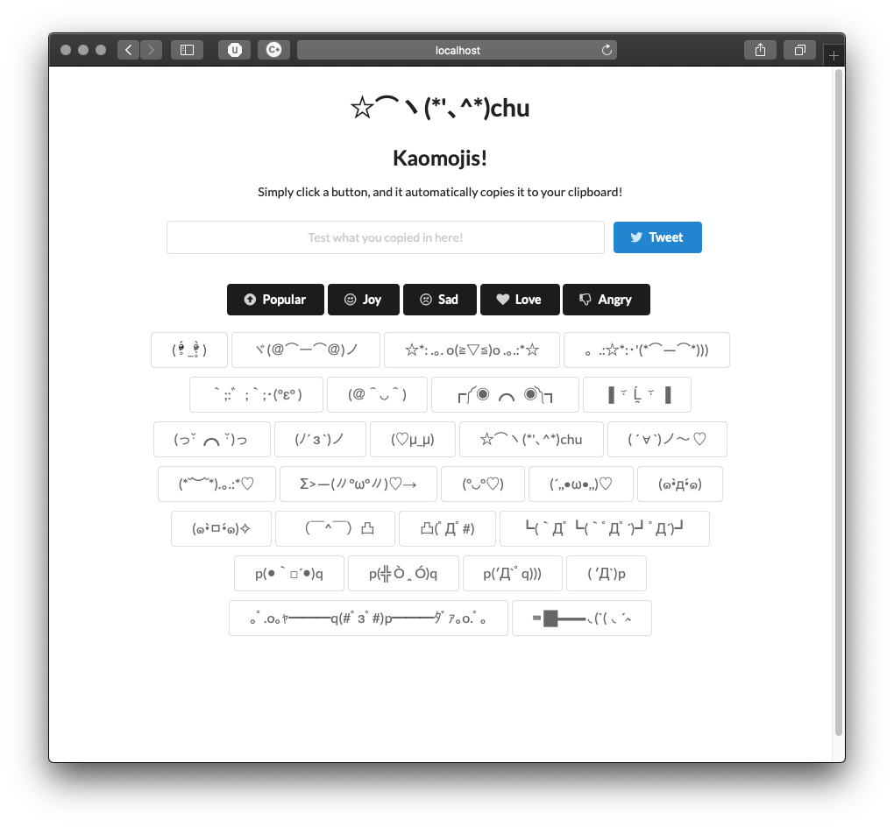

## test one two three..

[Demo](https://kaomojis.herokuapp.com/) (This may take awhile to load as server needs to 'wake up')

Japanese emoticon website, front-end using React & Semantic UI, back-end using Node.

Kind of like [this](http://japaneseemoticons.me), but the end result will be a lot more _lightweight_, _efficient_, and _easier to navigate_ through categories. 

I associated each emoticon with a button that copies to keyboard (much faster than highlighting and using cmd + c)

Currently a WIP, working on adding in MongoDB for easier JSON access as well as more kaomojis  ☆*:.｡.o(≧▽≦)o.｡.:*☆ 

### How it looks for far:

